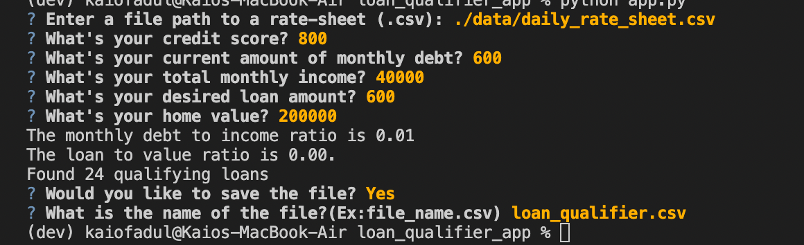

# Project Title
Just after the title, introduce your project by describing attractively what the project is about and what is the main problem that inspires you to create this project or what is the main contribution for the potential user of your project.

**Loan Analyzer**
The purpose of this project is to calculate the loan-to-value ratio so that we can evaluate the risk of lending money to the borrower. The analysis consist of the following terms: Loan, credit score, groos monthly income, debto-to-income ratio, and loan-to-value ratio. With all these information we can asses the risk of lending money to the borrrower.
---

## Technologies
Describe the technologies required to use your project such as programming languages, libraries, frameworks, and operating systems. Be sure to include the specific versions of any critical dependencies that you have used in the stable version of your project.

The following project requires you to have a VS code to run the the python programmming language and/or a terminal(mac)/Gitbash(windows). The project comes with different folders, called modules that those were the folders that I looped my calculations in the main project >"app.py." In the folders, you will find files that requires csv and programs that run python.
---

## Installation Guide
In this section, you should include detailed installation notes containing code blocks and screenshots.

My suggestion is for you to start from the README.md file before jumping into the project, so that you can understand what you are running into it. 
---

## Usage
This section should include screenshots, code blocks, or animations explaining how to use your project.

---

## Contributors
In this section, list all the people who contribute to this project. You might want recruiters or potential collaborators to reach you, so include your contact email and, optionally, your LinkedIn or Twitter profile.

---

## License
When you share a project on a repository, especially a public one, it's important to choose the right license to specify what others can and can't with your source code and files. Use this section to include the license you want to use.

**Feel free to use the project as you wish. Play around, and have fun! Things are just better when sharing.**

